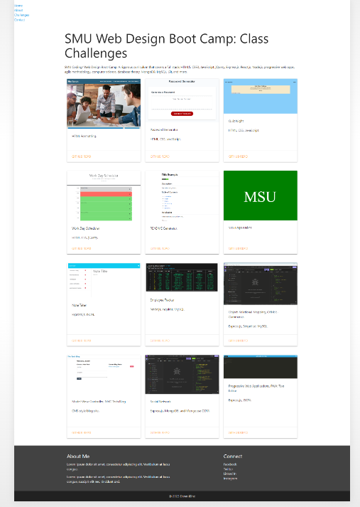

# 20 React: React Portfolio

## Table of Contents
- [Description](#description)
- [User Specifications](#user-specifications)
- [Functionality](#functionality)
- [Mock-Up](#mock-up)
- [Screenshots](#screenshots)
- [Deliverables](#deliverables)

## Description

Being a web developer means being part of a community. You’ll need a place not only to share your projects while you're applying for jobs or working as a freelancer but also to share your work with other developers and collaborate on projects.

The task is to create a portfolio using React. 

## User Specifications

AS AN employer looking for candidates with experience building single-page applications
I WANT to view a potential employee's deployed React portfolio of work samples
SO THAT I can assess whether they're a good candidate for an open position

## Functionality

When the user loads the portfolio, the user is presented with a page containing a header, a section for content, and a footer

When the user views the header, the user is presented with the developer's name and navigation with titles corresponding to different sections of the portfolio

When the user views the navigation titles, the user is presented with the titles About Me, Portfolio, Contact, and Resume, and the title corresponding to the current section is highlighted

When the user clicks on a navigation title, the user is presented with the corresponding section below the navigation without the page reloading and that title is highlighted

When the user loads the portfolio the first time, the About Me title and section are selected by default

## Mock-Up

The following animation shows the web application's appearance and functionality:

## Screenshots 

## Deliverables

The URL of the functional, deployed application:  https://dawn-kline-m.github.io/react-portfolio/

The URL of the GitHub repository: https://github.com/dawn-kline-m/react-portfolio

